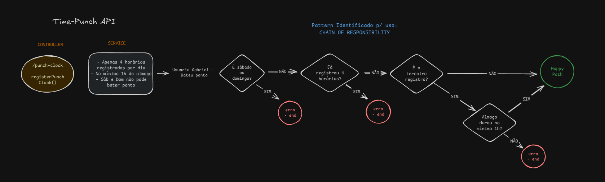
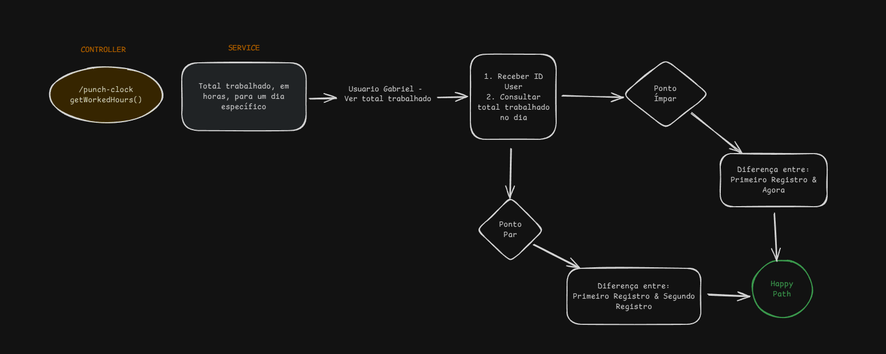
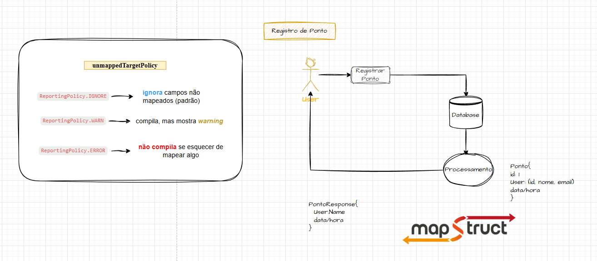

# TimePunch API

## 📌 Projeto de Estudos, Conceitos & Tecnologias

Este repositório é um projeto de estudos, onde aplico diferentes conceitos de desenvolvimento de software e integro 
diversas tecnologias para aprimorar e praticar meus conhecimentos.

### ⏰ Controle de Ponto - Web API
 
A aplicação implementa um sistema simples de controle de ponto

## 🚀 Tecnologias e Conceitos Aplicados

- ☕ **Java 21**: Porque sou fã.
- **Spring Boot 3.4.3**: Pois, neste GitHub amamos um Spring 🌱
- 🗄 **Banco de Dados em Memória (H2)**: Para facilitar a execução e os testes da aplicação. ️
- 🧪 **Cobertura de Testes**: Diferentes tipos de testes, para ~~garantir qualidade e confiabilidade~~ praticar e 
  melhorar no desenvolvimento dos testes, é claro. 😅
- 📜 **Open API & Swagger**: Documentação interativa ~~para facilitar integrações~~ porque facilita, e ninguém gosta de 
  adivinhar os 
  endpoints 
- 🧹 **Checkstyle**: Para garantir um Padrão de Código consistente e padronizado em todo o projeto. 
- 🐳 **Docker**: Containerização para execução simplificada.
- 🤖 **GitHub Actions**: CI/CD para rodar os testes e avisar quando eu fizer besteira. 
- **Design Pattern**: 🎭
  - Chain of Responsibility: Aplicado no fluxo de registro de horas trabalhadas.

---

## 🔗 Fluxos da Aplicação & Conceitos na Prática

### 📝 Registro de Horas Trabalhadas & Design Pattern (Chain of Responsibility)

A implementação do registro de ponto segue o padrão de projeto **Chain of Responsibility**, garantindo modularidade e flexibilidade:

- Cada validação é um handler separado.
- Facilita a adição de novas regras sem impactar o restante do sistema.
- Código mais organizado e manutenível.



### 🔍 Consulta de Horas Trabalhadas

O sistema permite consultar as horas trabalhadas de cada funcionário.



### Mapper para conversão entre objetos

Utilização da biblioteca Map-Structure para a [vídeo aula](https://www.youtube.com/playlist?list=PLJY_r_7q1iG_Ns5AA1Lahv1SYHcc3VA6Q) sobre mapper.



---

## ⏯️ Como Executar a Aplicação

### 1️⃣ Via Docker (Recomendado) 🐳

1. Clone o repositório:
   ```bash
   git clone https://github.com/bragabriel/timepunch-api
   ```

2. Execute o comando:
    ```
    docker-compose up --build
    ```

### #️⃣ Rodando Localmente 💻

1. Clone o repositório:
    ```
    git clone https://github.com/bragabriel/timepunch-api
    ```

2. Navegue até o diretório do projeto:
    ```
    cd timepunch-api
    ```

3. Execute a aplicação via Maven:
    ```
    mvn spring-boot:run
    ```

### 🌐 Endpoints e Documentação

- API Base URL: http://localhost:8080
- Swagger UI: http://localhost:8080/swagger-ui/index.html

### 💬 Usuários de Teste:
Usuários para teste da aplicação

| Nome    | ID  |
|---------|----:|
| Gabriel |  1  |
| João    |  2  |
| Maria   |  3  |

## 🎯 Considerações Finais

Este projeto não é apenas um CRUD qualquer – é um **campo de testes** para aprender, experimentar e evoluir no 
desenvolvimento backend.

A ideia é explorar tecnologias, testar padrões, quebrar coisas (e consertá-las depois), além de garantir que cada aprendizado fique bem documentado.

Sinta-se à vontade para dar sugestões, abrir PRs ou simplesmente rodar e testar. Bora codar! 🚀

---

## 👨‍💻 Author

Created by Gabriel Braga — [LinkedIn](https://www.linkedin.com/in/gabriel-braga-da-silva/) |
[Twitter](https://x.com/gbraga_dev) |
[YouTube](https://www.youtube.com/@gabrielbragadev)