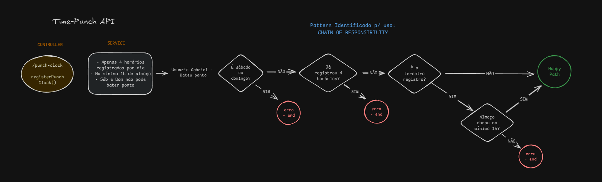
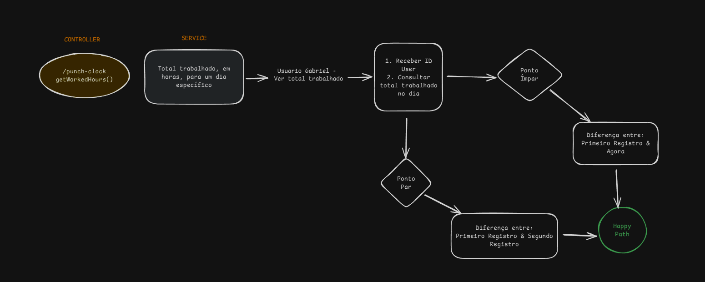

# ⏰ Controle de Ponto - Web API

Este projeto implementa uma API RESTful para o controle de ponto de funcionários.

## 🚀 Funcionalidades

### O projeto contempla:

* **Java**: Versão 21.
* **Framework**: Spring 3.4.3.
* **Banco de Dados em Memória**: H2.
* **Testes**: Cobertura de testes para garantir a funcionalidade do projeto.
* **Contrato Open API**: Definição clara de mensagens de entrada, respostas e erros.
* **Swagger**: Documentação interativa disponível em `/swagger-ui.html`.
* **Checkstyle**: Garantindo coerência e padrões de código por todo o projeto.
* **Docker**: A aplicação está configurada para rodar via Docker. Para mais detalhes, veja a seção: [Como rodar a 
  aplicação](#como-rodar-a-aplicação).
*  **GitHub Actions**: Integração contínua garantindo que cada PR aberto para a branch `main` passe por validação automatizada, incluindo:
    - Build da aplicação
    - Execução dos testes
    - Análise de código com Checkstyle

### 🔗 Fluxos da Aplicação

#### Registro de Horas Trabalhadas 📝

Para garantir uma arquitetura modular e flexível, utilizei o Design Pattern **Chain of Responsibility 🎭** no fluxo de 
registro das 
horas trabalhadas. Isso permite:

- Separar cada validação em um handler específico.
- Facilitar a adição ou remoção de novas regras sem impacto nas demais.
- Melhor organização e manutenibilidade do código.

Abaixo, um fluxograma ilustrando o funcionamento dessa abordagem:

---

#### Consulta de Horas Trabalhadas 🔍
Abaixo, um fluxograma ilustrando o funcionamento do sistema de consulta das horas trabalhadas:



## ⏯️ Como rodar a aplicação

### 1. Via Docker 🐳 (Recomendado) 

1. Clone o repositório:
```bash
git clone https://github.com/bragabriel/timepunch-api
```

2. Execute o seguinte comando:

```bash
docker-compose up --build
```
Esse comando irá:

1. Construir a imagem da aplicação.
2. Inicializar o banco de dados H2.
3. Executar a API localmente.

### 2. Rodando Localmente 💻 (sem Docker) 
Caso prefira rodar sem Docker, siga os passos abaixo:

1. Clone o repositório:

```bash
git clone https://github.com/bragabriel/timepunch-api
```

Navegue até o diretório do projeto:

```bash
cd timepunch-api
```

Execute a aplicação via Maven:

```bash
mvn spring-boot:run
```

Ao optar por rodar a aplicação localmente, você deve preencher as variáveis de ambiente em sua máquina. Veja mais 
em: '[exemplo de configuração](#exemplo-de-configuração)'.

### 📌 Observações

- A API estará disponível em **[http://localhost:8080](http://localhost:8080)**.
- O **Swagger** estará disponível em **[http://localhost:8080/swagger-ui/index.html](http://localhost:8080/swagger-ui/index.html)**
- O projeto já inclui três usuários cadastrados para testes, sendo eles:

  | Nome    | ID  |
      |---------|----:|
  | Gabriel |  1  |
  | João    |  2  |
  | Maria   |  3  |

## 🌍 Configuração do Ambiente

O projeto utiliza o arquivo `.env` para configurar variáveis de ambiente, como senhas e dados do banco de dados. 
Estes segredos devem ser armazenados em locais seguros, como um gerenciador de segredos. Para fins demonstrativos, 
forneço abaixo o formato das variáveis a serem preenchidas.

### Exemplo de configuração:

Renomeie o arquivo `.env.example` para `.env` e preencha as variáveis conforme necessário:

```env
SPRING_PROFILES_ACTIVE=prod
SPRING_DATASOURCE_URL=jdbc:h2:mem:timepunchdb
SPRING_DATASOURCE_USERNAME=sa
SPRING_DATASOURCE_PASSWORD=password
```

A partir deste ponto, o **Docker Compose** será responsável por injetar essas variáveis de ambiente dentro do container,
e o **Dockerfile** as utilizará durante o processo de build para configurar corretamente a aplicação.

➡️ Caso prefira rodar a aplicação sem o Docker, você deve configurar as variáveis de ambiente manualmente no seu sistema