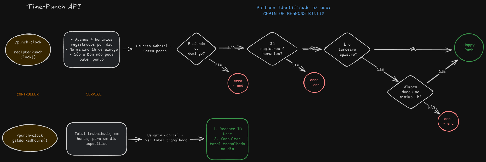

# Controle de Ponto - Web API

Este projeto implementa uma API RESTful para o controle de ponto de funcionários.

## Funcionalidades

## O projeto contempla:

- [x] **Contrato Open API**: Seguindo o formato de mensagens de input, response e erros.
- [x] **Java**: Versão 21.
- [x] **Framework**: Spring 3.4.3.
- [x] **Banco de Dados em Memória**: H2.
- [x] **Docker**: A aplicação está configurada para rodar via Docker. Para rodar, veja a seção: "[Como rodar a aplicação](#como-rodar-a-aplicação)".
- [x] **Testes**: Cobertura de testes unitários e de integração.
- [x] **GitHub Actions**: Integração contínua garantindo que cada PR aberto para a branch `main` passe por validação automatizada, incluindo:
    - Build da aplicação
    - Execução dos testes
    - Análise de código com Checkstyle

---

## Fluxo de Registro de Horas Trabalhadas

### Design Pattern - Chain of Responsibility

Para garantir uma arquitetura modular e flexível, utilizamos o **Chain of Responsibility** no fluxo de registro das horas trabalhadas. Isso permite:

- Separar cada validação em um handler específico.
- Facilitar a adição ou remoção de novas regras sem impacto nas demais.
- Melhor organização e manutenibilidade do código.

Abaixo, um fluxograma ilustrando o funcionamento dessa abordagem:


---

## Como rodar a aplicação

### 1. Via Docker (Recomendado)

Clone o repositório e execute o seguinte comando:

```bash
docker-compose up --build
```
Isso irá:

1. Construir a imagem da aplicação. 
2. Subir o banco de dados H2. 
3. Rodar a API localmente.

### 2. Rodando Localmente sem Docker
Caso queira rodar sem Docker, siga os passos abaixo:

1. Clone o repositório:

```bash
git clone https://github.com/bragabriel/timepunch-api
```

Navegue até o diretório do projeto:

```bash
cd timepunch-api
```

Execute a aplicação via Maven:

```bash
mvn spring-boot:run
```

OBS: **A API estará disponível em http://localhost:8080.**
